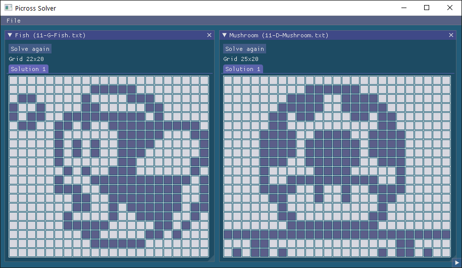
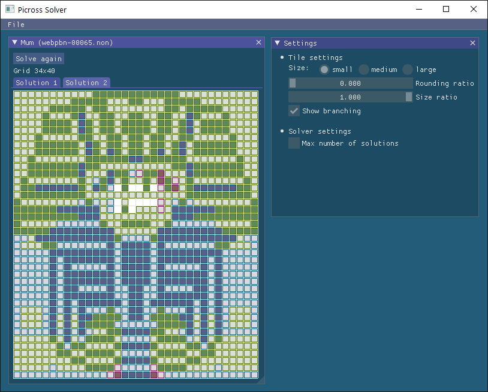

Picross Solver Library
======================

Picross is a puzzle game, also called nonogram or paint-by-number.
The goal is to find a hidden picture in a rectangular grid, by painting some of the cells
with one color, or leaving them blank. The information given is, for each row and each
column, the number and size of the segments of continuous filled cells on that line.

This is a solver library for picross puzzles. The solver will find the solutions of a grid
based on the row and column constraints given as input. The solver handles grids with
multiple solutions and can be used as a validator to check the uniqueness of the
solution.

## Features

 - The solver library has no dependencies other than C++17
 - Compilation of the library is checked against: MSVC, gcc, clang.
 - Black and white puzzles only
 - Handle puzzles with multiple solutons and check for uniqueness
 - Three puzzle file formats are supported:
   - Steve Simpson's [NON format](doc/FILE_FORMAT_NON.md)
   - Jakub Wilk's [NIN format](doc/FILE_FORMAT_NIN.md)
   - A native format created for this library
 - Fast, and battle-tested on a wide range of puzzles: [Performance](doc/PERF.md)
 - Two applications on top of the library: CLI and GUI.
 - Use the GUI to [make your own picross puzzles](doc/Create_a_Picross.md)!

There's a demo video: [Here](https://www.youtube.com/watch?v=svnpxgFXfuE)!

## Library

The Picross solver provided as a library

### Build

With [CMake](https://cmake.org/download/). For example on Windows:

```
mkdir ./build
cd build
cmake -G "Visual Studio 17 2022" ..
cmake --build . --config Release
```

### Unit Tests

Dependencies:

*  [Catch2](https://github.com/catchorg/Catch2)
*  [PNM++](https://github.com/ToruNiina/pnm)

Build and run unit tests:

```
cmake -G "Visual Studio 17 2022" -DPICROSS_BUILD_TESTS=ON ..
cmake --build . --target run_utests_picross --config Debug
```

### Install

Install in some dir:

```
cmake --install . --config Release --prefix <some_dir>
```

Or, package the library:

```
cpack -G ZIP -C Release
```

### CMake Integration

The library CMake's build exports the following target: `picross::picross`

### Example

Below is an example of how to use the library.
The API is accessible via a unique header file [`<picross/picross.h>`](src/picross/include/picross/picross.h)

_Source: [example_1.cpp](src/examples/src/example_1.cpp)_
```cpp
#include <picross/picross.h>

#include <cassert>
#include <cstdlib>
#include <iostream>

int main()
{
    // Puzzle definition
    const picross::InputGrid::Constraints rows {
        { 3 },
        { 1, 1 },
        { 1, 1 },
        { 3 },
        { 3 },
        { }
    };
    const picross::InputGrid::Constraints cols {
        { },
        { 2 },
        { 2 },
        { 5 },
        { 1 },
        { 3 }
    };
    picross::InputGrid puzzle(rows, cols, "Note");

    // [Optional] Check the puzzle validity
    const auto [check_is_ok, check_msg] = picross::check_input_grid(puzzle);
    if (!check_is_ok)
        return EXIT_FAILURE;

    // Solve the puzzle
    const auto solver = picross::get_ref_solver();
    assert(solver);
    constexpr unsigned int max_nb_solutions = 2;
    const auto result = solver->solve(puzzle, max_nb_solutions);
    if (result.status != picross::Solver::Status::OK)
        return EXIT_FAILURE;

    // Print out the solutions
    assert(!result.solutions.empty());
    for (const auto& solution : result.solutions)
        std::cout << solution.grid << std::endl;

    return EXIT_SUCCESS;
}
```

Output:

```
...###
...#.#
...#.#
.###..
.###..
......
```
## Applications

A CLI and a GUI applications built on top of the solver library.

The applications are able to read puzzle files in the formats listed above for the library, and also raw images in the following formats:

* Bitmap: [PBM files](https://fr.wikipedia.org/wiki/Portable_pixmap)
* Raw text with the '.' and '#' characters: [Example](./inputs/raw/note.txt)
* Raw text with the '0' and '1' characters: [Example](./inputs/raw/rand11.txt)

### Dependencies

Common to all:

* [PNM++](https://github.com/ToruNiina/pnm)

Command line interface:

* [Argagg](https://github.com/vietjtnguyen/argagg)

Graphical UI:

* OpenGL
* [GLFW](https://www.glfw.org/)
* [Dear ImGui](https://github.com/ocornut/imgui)
* [Portable File Dialogs](https://github.com/samhocevar/portable-file-dialogs)

### Build

On Windows:

```
mkdir ./build
cd build
cmake -G "Visual Studio 17 2022" -DPICROSS_BUILD_APP=ON -DPICROSS_BUILD_CLI=ON ..
cmake --build . --config Release
```

### Command Line Tool Usage

#### Basic Usage

Run the CLI on the example file:

```
./build/bin/Release/picross_solver_cli.exe inputs/example_input.txt
```

To see all the CLI options do:

```
./build/bin/Release/picross_solver_cli.exe --help
```

#### Solve and Convert Format

Convert a single input to another file format. The output formmat is deduced from the fileanme extension. Available output formats are: NIN, NON, the native format and bitmap (PBM). The grid is solved and if the output format supports it, the solution is included in the saved file as the intended goal.

```
./build/bin/Release/picross_solver_cli.exe inputs/note.nin --output inputs/note.non --quiet
```

#### Validation Mode

Use the validation mode to test multiple files at once and check the uniqueness of the solution.
 - Output one line per puzzle, in a comma-separated format.
 - Validation is `OK` if the puzzle is valid and has a unique solution
 - Difficulty hint: `LINE` for puzzles that are line solvable, `BRANCH` for puzzles that have a unique solution but are not line solvable, and `MULT` for grids with multiple solutions.
 - Performance timing

For example:
```
./build/bin/Release/picross_solver_cli.exe --validation ./inputs/example_input.txt ./inputs/domino_logic.txt
```

The output, in CSV format, will contain the following information:

|File              |Grid   |Size  |Valid   |Difficulty|Solutions|Timing (ms)|
|------------------|-------|-----|---------|----------|---------|-----------|
|example_input.txt |Fish|22x20|OK|LINE|1|0.4495|
|example_input.txt |Two Notes|10x10|MULT|MULT|2|0.668|
|domino_logic.txt  |3-Dom|7x7|OK|BRANCH|1|0.0981|
|domino_logic.txt  |4-Dom|9x9|OK|BRANCH|1|0.855|
|domino_logic.txt  |5-Dom|11x11|OK|BRANCH|1|4.0144|
|domino_logic.txt  |6-Dom|13x13|OK|BRANCH|1|15.402|
|domino_logic.txt  |7-Dom|15x15|OK|BRANCH|1|159.027|
|domino_logic.txt  |8-Dom|17x17|OK|BRANCH|1|1628|
|domino_logic.txt  |9-Dom|19x19|OK|BRANCH|1|21867.5|

### Make your own Puzzles with the GUI

See tutorial [here](doc/Create_a_Picross.md).

### Screenshots of the GUI

The GUI shows an animation of the solving process, and finally the solution(s). Here are two examples
from the game Picross DS:



The hardest puzzles are not line solvable, meaning they cannot be solved simply by using the usual
method of iterating on individual rows and columns. When no further progress can be made, the algorithm
has to test different alternatives in order to reach a solution. That backtracking mechanism
is shown with tiles of varying colors:


("Mum" puzzle by Jan Wolter: https://webpbn.com/index.cgi?id=65)

## Contributions

This project does not accept pull requests at the moment.

Please [submit an issue](https://github.com/pierre-dejoue/picross-solver/issues/new) for a feature request, a bug report or any question.

## License

[](./LICENSE)


