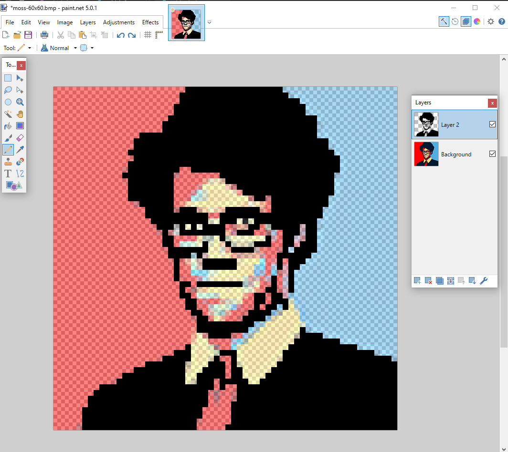
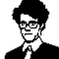
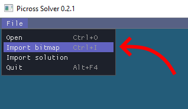
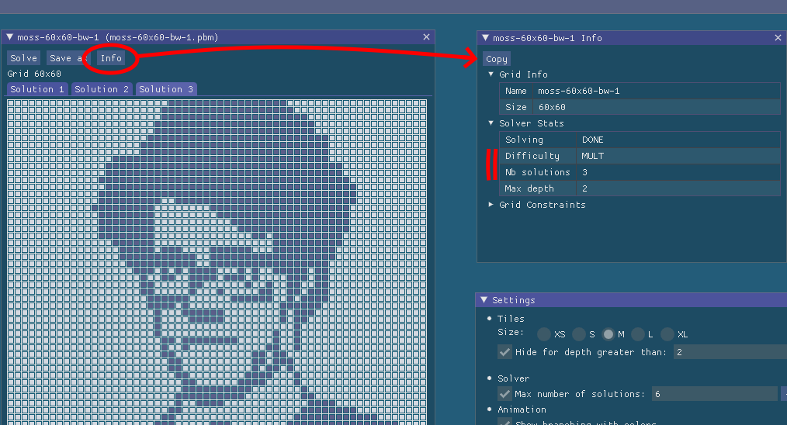
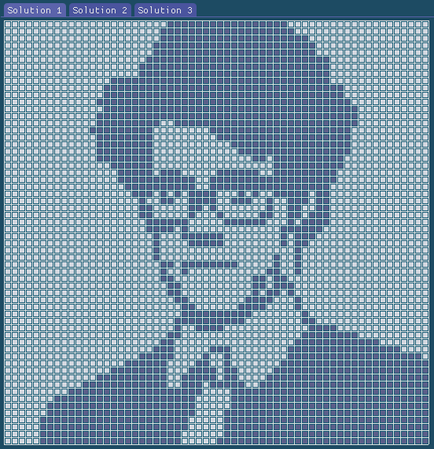
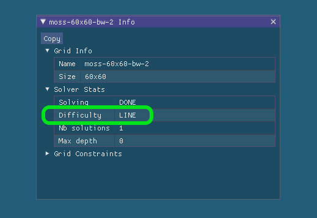
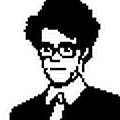

Create a Picross Puzzle
=======================

Despite the main focus of the GUI application being on the actual solving of the puzzles, it can be used as a helper to create original picross.

On this page we dive into the process of making a new puzzle and present some of the functionalities of the GUI along the way.

## First Sketch of the Puzzle

Using our favorite image editor, we draw a first sketch of a target image. The image has to be black and white and saved as a Portable Bitmap file (PBM), which is at this time the only bitmap format that can be imported in the Picross Solver.

Here is our first test image:

 
(Bitmap file: [moss-60x60-bw-1.pbm](../inputs/raw/moss-60x60-bw-1.pbm))

## Import the Bitmap image into the GUI

Import the bitmap in the Picross Solver. The solving process will start immediately.

## Check the Difficulty of Solving the Puzzle

Once the solving process has completed, the difficulty of the puzzle is visible in the Info window associated with the puzzle. There are basically three families of puzzles:

|Difficulty |                                                                  |
|-----------|------------------------------------------------------------------|
|LINE       |Unique solution, and the grid is line-solvable                    |
|BRANCH     |Unique solution, but not line-solvable (some guessing required)   |
|MULT       |The solution is not unique                                        |

Line-solvable (i.e. **LINE**) means that the puzzle can be solved going one line at a time. This is the level of difficulty one should aim at. Some websites, for instance [nonograms.net](https://www.nonograms.org/), only accept line solvable puzzles.

**BRANCH** difficulty can be interesting too, in the sense that the puzzle still has a unique solution. We check the branching depth ("Max depth" in the Info window) and watch the solving animation to get a grasp of how much guessing is required. Most likely such a puzzle will be quite hard to solve for a human.

**MULT** difficulty should be avoided, since the solution is not unique. Unfortunately, the first sketch of a puzzle will most likely fall into that category.

For example, we can see below that our first test image has three solutions:

As a final note, if the solver does not finish, the puzzle will most likely be almost impossible to solve for a human.

## Iterate

Looking at the solver animation and/or the difference between the solutions allows us to identify which parts of the image are impossible to solve in a unique way:

We then edit those parts to make them more picross-friendly. Usually that involves adding more dark pixels and avoiding some patterns like the [switch](../inputs/test_pattern_14.txt):

## First Line-Solvable Puzzle

Import the bitmap again and see if the solving is getting easier. With a few iterations of that process we are able to get a **LINE** solvable puzzle:

 
(Bitmap file: [moss-60x60-bw-2.pbm](../inputs/raw/moss-60x60-bw-2.pbm))

We iterate some more, this time with a focus on the aesthetic aspect of the final puzzle.

 
(Bitmap file: [moss-60x60-bw-3.pbm](../inputs/raw/moss-60x60-bw-3.pbm))

## Save as a Picross file

Save the puzzle ("Save as" button) in one of the availalble picross file format. For example, the [NON format](../inputs/webpbn/webpbn-36459-moss.non).

And submt it on our favorite website [webpbn #36459](https://webpbn.com/play.cgi?id=36459&sid=)!
